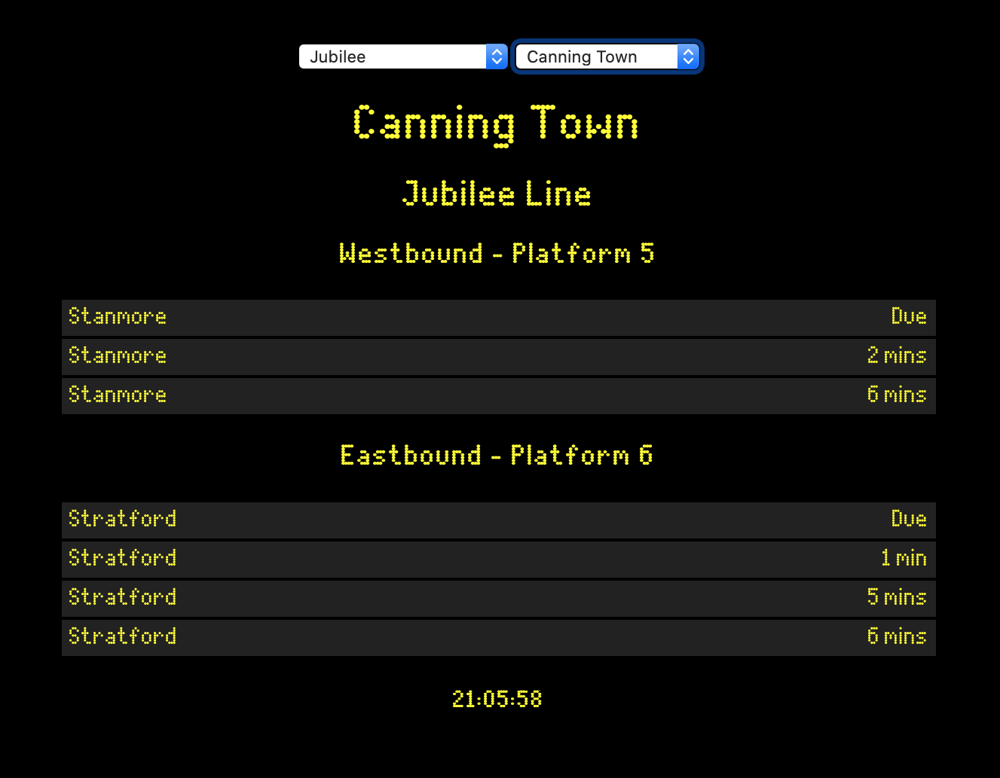

# Tube Station Departure Board

Dot-matrix-style departure board for any tube station, using data from [transportapi](https://transportapi.com).



## Getting Started

### Requirements

- [yarn](https://yarnpkg.com) or [npm](https://npmjs.com)
- a [transportapi](https://transportapi.com) account

### Instructions

1. Clone this repo (including submodules to make sure you get the fonts):

    ```
    git clone --recurse-submodules https://github.com/mattbattison/departure-board
    ```

1. Set appropriate values in ```.env``` for your system:

    - **REACT_APP_TRANSPORT_API_BASE_URL** - this is the base URL that the application will use when making requests to the [transportapi](https://transportapi.com) API. Usually, it should be set to ```https://transportapi.com``` (note the lack of trailing slash). However, it might be desirable to point this at a proxy so that the API keys can be appended without leaking them to the front-end. 
    - **REACT_APP_TRANSPORT_API_APP_KEY** - this is your app key from transportapi. It will be a 32-character string. Can be left blank if you are using a proxy to append the key/ID.
    - **REACT_APP_TRANSPORT_API_APP_ID** - this is your app ID from transportapi. It will be an 8-character string. Can be left blank if you are using a proxy to append the key/ID.
    - **REACT_APP_INITIAL_LINE** - should be set to the short name of the line to display when the app is first loaded e.g. ```jubilee``` for the Jubilee Line. See ```StationSelector.js``` for a full list.
    - **REACT_APP_INITIAL_STATION** - should be set to the code of the station to display when the app is first loaded e.g. ```CNT``` for Canning Town.

1. Run the production build:

    ```
    cd departure-board
    yarn build
    ```

1. Serve using the ```serve``` package (quick start):

    ```
    yarn global add serve
    serve -s build
    ```
    
    or use your faviourite web server (configuration required):

    ```
    cp -R build/ /var/www/departure-board

    # now configure your web server ...
    ```

---

This project was bootstrapped with [Create React App](https://github.com/facebook/create-react-app).

## Available Scripts

In the project directory, you can run:

### `yarn start`

Runs the app in the development mode.<br />
Open [http://localhost:3000](http://localhost:3000) to view it in the browser.

The page will reload if you make edits.<br />
You will also see any lint errors in the console.

### `yarn test`

Launches the test runner in the interactive watch mode.<br />
See the section about [running tests](https://facebook.github.io/create-react-app/docs/running-tests) for more information.

### `yarn build`

Builds the app for production to the `build` folder.<br />
It correctly bundles React in production mode and optimizes the build for the best performance.

The build is minified and the filenames include the hashes.<br />
Your app is ready to be deployed!

See the section about [deployment](https://facebook.github.io/create-react-app/docs/deployment) for more information.

### `yarn eject`

**Note: this is a one-way operation. Once you `eject`, you can’t go back!**

If you aren’t satisfied with the build tool and configuration choices, you can `eject` at any time. This command will remove the single build dependency from your project.

Instead, it will copy all the configuration files and the transitive dependencies (Webpack, Babel, ESLint, etc) right into your project so you have full control over them. All of the commands except `eject` will still work, but they will point to the copied scripts so you can tweak them. At this point you’re on your own.

You don’t have to ever use `eject`. The curated feature set is suitable for small and middle deployments, and you shouldn’t feel obligated to use this feature. However we understand that this tool wouldn’t be useful if you couldn’t customize it when you are ready for it.

## Learn More

You can learn more in the [Create React App documentation](https://facebook.github.io/create-react-app/docs/getting-started).

To learn React, check out the [React documentation](https://reactjs.org/).

### Code Splitting

This section has moved here: https://facebook.github.io/create-react-app/docs/code-splitting

### Analyzing the Bundle Size

This section has moved here: https://facebook.github.io/create-react-app/docs/analyzing-the-bundle-size

### Making a Progressive Web App

This section has moved here: https://facebook.github.io/create-react-app/docs/making-a-progressive-web-app

### Advanced Configuration

This section has moved here: https://facebook.github.io/create-react-app/docs/advanced-configuration

### Deployment

This section has moved here: https://facebook.github.io/create-react-app/docs/deployment

### `yarn build` fails to minify

This section has moved here: https://facebook.github.io/create-react-app/docs/troubleshooting#npm-run-build-fails-to-minify
